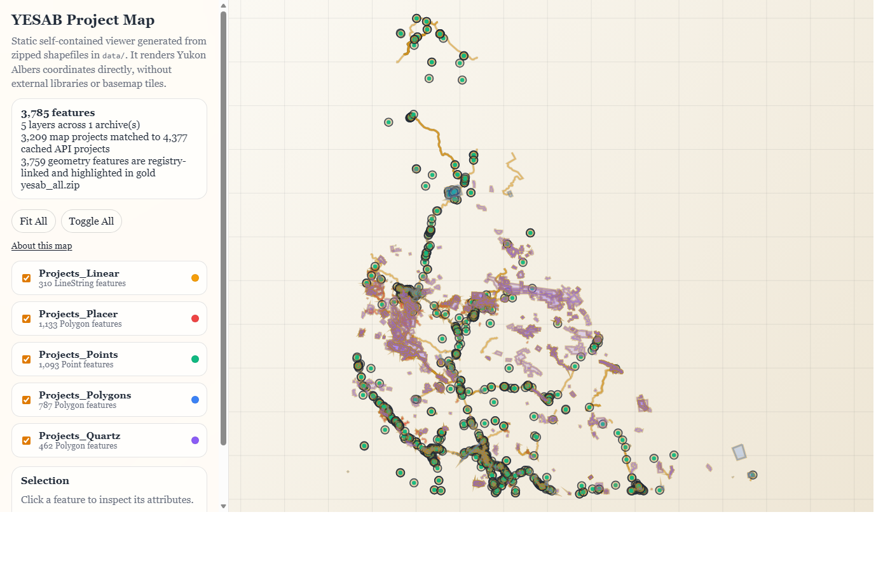

# YESAB Static Map Builders

YESAB is the Yukon Environmental and Socio-economic Assessment Board, which tracks assessment projects across Yukon. This repository exists to pull the published project map data and registry metadata into reproducible local artifacts so it is easier to inspect, rebuild, and share static map outputs without depending on the live services at runtime.

- downloading the [YESAB Project Map](https://yesab.ca/project-map/) - [shapefile archive](https://yesab.ca/wp-content/plugins/yesab-map-wp-plugin/geojson/all.zip)
- fetching and caching the [YESAB registry API](https://yesabregistry.ca/api/integration/projects) in year buckets
- joining the shapefile archive and registry API data into a single GeoPackage, filtering approximate locations into their own class
- building static map outputs from the previous steps

The workhorse or main value of the project is the combined shapefile and registry API data in a single geospatial package. It is one step of a larger internal ETL (extract, transform, load) pipeline. The maps are demos, toys made to quickly view the data and illustrate the concept of a self-contained dynamic map.

Example of refreshing and building the GeoPackage from scratch:

```
❯ uv run scripts/refresh_and_build_geopackage.py
Step 1/3: refresh YESAB project map archive
Checking YESAB all.zip...
Local dataset missing, forcing download: /var/home/matt/dev/yesab/data/yesab_all.zip
Download complete
State updated: {'last_modified': 'Mon, 11 May 2026 19:26:06 GMT', 'content_length': '2333858'}
Step 2/3: refresh YESAB API cache
Reusing cached 2026-2026: /var/home/matt/dev/yesab/data/api/buckets/projects_2026-2026.json.zst
State file    : /var/home/matt/dev/yesab/data/api/state.json
Merged cache  : 4617 projects from 7 bucket(s)
Merged dataset: /var/home/matt/dev/yesab/data/api/projects_merged.json.zst
  - 2005-2005 : /var/home/matt/dev/yesab/data/api/buckets/projects_2005-2005.json.zst
  - 2006-2010 : /var/home/matt/dev/yesab/data/api/buckets/projects_2006-2010.json.zst
  - 2011-2015 : /var/home/matt/dev/yesab/data/api/buckets/projects_2011-2015.json.zst
  - 2016-2020 : /var/home/matt/dev/yesab/data/api/buckets/projects_2016-2020.json.zst
  - 2021-2025 : /var/home/matt/dev/yesab/data/api/buckets/projects_2021-2025.json.zst
  - 2025-2025 : /var/home/matt/dev/yesab/data/api/buckets/projects_2025-2025.json.zst
  - 2026-2026 : /var/home/matt/dev/yesab/data/api/buckets/projects_2026-2026.json.zst
Step 3/3: build GeoPackage
Wrote /var/home/matt/dev/yesab/out/yesab-projects.gpkg
  Projects_Linear: 310 features
  Projects_Placer: 1133 features
  Projects_Points: 1093 features
  Projects_Polygons: 787 features
  Projects_Quartz: 462 features
  API_Approximate_Points: 1263 features
```  

Example of building a single self-contained map:

```
❯ uv run scripts/build_static_map_single.py
Wrote out/yesab-map-in-one.html with 6 layers and 5048 features.
Output size: 19.6 MB
YESAB shapefile date: 2026-05-11 12:26 YST
Latest registry change: 2026-04-21 13:53 YST (2025-0172, Adequacy Review Response ended)
Wrote QA artifacts: yesab-map-in-one.qa.html, yesab-map-in-one.qa.json
```

Build the optional browser-native compressed wrapper when you need a smaller
single-file artifact for sharing:

```
❯ uv run scripts/build_static_map_single.py --compressed
Wrote out/yesab-map-in-one.html with 6 layers and 5048 features.
Output size: 19.6 MB
Wrote compressed wrapper: out/yesab-map-in-one.compressed.html (5.4 MB)
...
```

The compressed wrapper embeds a gzip copy of the generated
`yesab-map-in-one.html` bytes and reconstructs the original document in browsers
that support `DecompressionStream("gzip")`. Keep `yesab-map-in-one.html` as the
canonical compatibility artifact.

[](out/yesab-map-in-one.html)

## Output geopackage metadata 

**Summary**: Project points and areas from Yukon Environmental and Socio-economic Assessment Board, with YESAB registry metadata when a project-number match is available. Uses approximate point locations when no shapefile geometry exists.

**Description**: {todo: insert data sources}


## Scripts

- `scripts/download_project_map_archive.py` - Downloads `all.zip` only when the remote file changed.
- `scripts/refresh_api_cache.py` - Caches YESAB API project records into local year-bucket Zstandard-compressed JSON files and writes a merged dataset.
- `scripts/download_project_bundle.py` - Mirrors the public Registry project page APIs into one local JSON-plus-attachments bundle for a project URL, ID, or number. See `docs/project-bundle-downloads.md` for attachment filename and timestamp heuristics.
- `scripts/build_geopackage.py` - Builds an enriched GeoPackage shapefile/API joins and approximate API-only points.
- `scripts/refresh_and_build_geopackage.py` - wrapper for downloading the latest map archive, refreshing the API cache, and building the GeoPackage in one command.
- `scripts/deploy_to_production.py` - Mirrors the deployable code subset to the production ETL workspace.
- `scripts/build_static_map_single.py` - Builds a single self-contained HTML file, with an optional compressed wrapper.
- `scripts/build_static_map_split.py` - Builds a multi-file static site with separate HTML, CSS, JS, and layer data files.

## Usage

Run commands from the repository root. If you omit output arguments, the builders write safely into `./out` without clobbering each other.

Output arguments differ by builder:

- `scripts/build_static_map_single.py` accepts either an `.html` file path or a directory. Directory output writes `yesab-map-in-one.html` inside that directory.
- `scripts/build_static_map_single.py --compressed` also writes `yesab-map-in-one.compressed.html` next to the single-file output. Use `--compressed-output` to choose a different compressed `.html` path or output directory.
- `scripts/build_static_map_split.py` accepts an output directory and recreates that directory before writing.
- `scripts/build_geopackage.py` accepts a `.gpkg` file path.

Use `uv` with Python `3.14+`.

```powershell
uv run .\scripts\download_project_map_archive.py

uv run .\scripts\download_project_bundle.py https://yesabregistry.ca/projects/00ba642c-2cef-4a75-8412-6afa6ab76487/
uv run .\scripts\download_project_bundle.py 2025-0069 --zip

uv run .\scripts\refresh_api_cache.py
uv run .\scripts\refresh_api_cache.py --force
uv run .\scripts\refresh_api_cache.py --start-year 2024 --end-year 2025 --force
uv run .\scripts\refresh_api_cache.py --years 2022 2023 2024 --force

uv run .\scripts\build_static_map_single.py
uv run .\scripts\build_static_map_single.py --compressed
uv run .\scripts\build_static_map_single.py .\some-output-dir
uv run .\scripts\build_static_map_single.py .\some-output-dir --compressed-output .\some-output-dir\shared-map.html

uv run .\scripts\build_static_map_split.py
uv run .\scripts\build_static_map_split.py .\some-output-dir

uv run .\scripts\build_geopackage.py
uv run .\scripts\build_geopackage.py .\some-output.gpkg

uv run .\scripts\refresh_and_build_geopackage.py
uv run .\scripts\refresh_and_build_geopackage.py .\some-output.gpkg
uv run .\scripts\refresh_and_build_geopackage.py --force
uv run .\scripts\refresh_and_build_geopackage.py --years 2024 2025 --force .\some-output.gpkg
```

## Deployment

The production ETL code workspace is `\\envgeoserver\dev\YESAB\yesab_map`.

Preview the deploy plan without copying files:

```powershell
uv run .\scripts\deploy_to_production.py
```

Deploy the current clean checkout:

```powershell
uv run .\scripts\deploy_to_production.py --go
```

The deploy tool defaults to dry-run mode. Dry-run reports the selected files, mirror deletion behavior, and, when the checkout is dirty, separate scenarios for running with and without `--allow-dirty`. With `--go`, it runs tests, stages an allowlisted source subset, mirrors that subset into the dedicated production code directory, writes `deploy_manifest.json`, and runs a `--help` smoke check from the deployed copy. Mirror mode removes destination-only files under `yesab_map-toy-maker`. It intentionally excludes generated outputs, metrics, git metadata, and API cache state.

Non-default destinations are rejected unless `--allow-any-dest` is passed.

For in-progress handoff from a dirty checkout, use:

```powershell
uv run .\scripts\deploy_to_production.py --go --allow-dirty
```

## Testing

Run the regression tests with the same Python version the builders require:

```powershell
uv run --python 3.14 python -m unittest discover -s tests
```

For new join, QA, API fallback, or details-panel behavior, add a failing fixture-style test first, then make both builders pass through the shared helper path.

Typical workflow:

1. Refresh the shapefile archive when needed.
2. Refresh the API cache.
3. Rebuild one or both map outputs.

## Output

Default output locations:

- `scripts/download_project_map_archive.py` writes:
  - `data/yesab_all.zip`
  - `data/yesab_all_zip.state.json`
- `scripts/refresh_api_cache.py` writes:
  - `data/api/buckets/projects_<start>-<end>.json.zst`
  - `data/api/projects_merged.json.zst`
  - `data/api/state.json`
- `scripts/download_project_bundle.py` writes:
  - `out/project-bundles/<project-id-or-number>/manifest.json`
  - `out/project-bundles/<project-id-or-number>/json/`
  - `out/project-bundles/<project-id-or-number>/attachments/`
  - `out/project-bundles/<project-id-or-number>.zip` when `--zip` is used
- `scripts/build_static_map_single.py` writes:
  - `out/yesab-map-in-one.html`
  - `out/yesab-map-in-one.compressed.html` when `--compressed` or `--compressed-output` is used
  - `out/yesab-map-in-one.qa.html`
  - `out/yesab-map-in-one.qa.json`
- `scripts/build_static_map_split.py` writes:
  - `out/yesab-map/index.html`
  - `out/yesab-map/app.css`
  - `out/yesab-map/app.js`
  - `out/yesab-map/data/`
  - `out/yesab-map/qa_report.html`
  - `out/yesab-map/qa_report.json`
- `scripts/build_geopackage.py` writes:
  - `out/yesab-projects.gpkg`
- `scripts/refresh_and_build_geopackage.py` writes the same download, API cache, and GeoPackage outputs as the three scripts it chains.

The split builder removes and recreates only its own target directory before writing files.

## API Cache Behavior

`scripts/refresh_api_cache.py` defaults to refreshing the current year bucket only.

Older cache buckets stay on disk until you explicitly refresh them with `--force`.
This keeps the sync logic simple while still updating the projects most likely to change.

Refresh API cache buckets sequentially. The script uses a shared `data/api/state.json` file and is not designed for concurrent writers.

As of June 4, 2026, the legacy `/api/integration/projects` endpoint used by
`scripts/refresh_api_cache.py` returns HTTP 404. Existing cached buckets can
still be reused, but forced refreshes or missing buckets fail until the cache
refresh is migrated to a replacement Registry endpoint.

## Notes

- Python `3.14+` is required for stdlib `compression.zstd` support.
- If `data/api/projects_merged.json.zst` exists, both map builders will enrich matching features with YESAB registry metadata.
- QA reports are generated with both builders so you can inspect map/API coverage and unmatched records. The map About panel includes the compact QA coverage summary; the separate QA HTML/JSON artifacts contain the detailed project lists.

## Follow-up Items

- Investigate whether the GeoPackage build should consume a shared data-preparation layer directly instead of depending on `scripts/build_static_map_single.py`. The current dependency works and keeps behavior aligned, but the pipeline order is surprising: static-map assembly now acts as the input path for the GIS artifact.

## Metrics Workflow

This repo uses lightweight agent-session, command-run, and decision metrics under `metrics/`.

```powershell
uv run .\scripts\run_timed.py --task-id tests -- uv run --python 3.14 python -m unittest discover -s tests
uv run .\scripts\summarize_metrics.py
```

## End notes

Built by Matt Wilkie at Yukon department of Environment. The code is open-source and available under the [MIT](LICENSE) and [Yukon Open Government](OPEN-GOVERNMENT-LICENCE-YUKON.txt) licenses. Provided as-is, without warranty or support.
